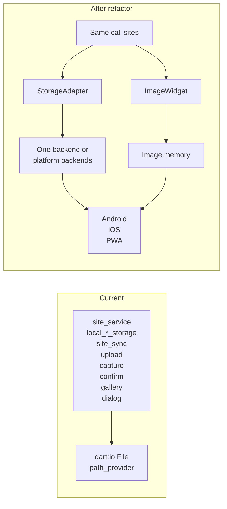

# PWA scope and outline

## 1. PWA limitations (explicit list)

- **Heading / orientation**
  - **Orientation dial** (“Turn to match”): does not show on PWA. Already gated: `orientation_dial.dart` returns `SizedBox.shrink()` when `kIsWeb` or `currentHeading == null`. No change needed beyond documenting.
  - **Heading capture** for sessions: `HeadingService` returns `null` on web, so `reference_heading` is never recorded from PWA; orientation at site is effectively unavailable there.
- **Compass**
  - `FlutterCompass` is not reliable on web; all heading-based UX is best treated as “mobile only” and already degrades gracefully (no dial, null heading).
- **File system**
  - `dart:io` `File` / `Directory` and `path_provider`’s `getApplicationDocumentsDirectory()` / `getTemporaryDirectory()` are **not available on web** (MissingPluginException). All persistence and “paths” must go through a cross-platform storage abstraction (see below).
- **Secure storage**
  - `flutter_secure_storage` has a **web implementation** (`flutter_secure_storage_web`); with correct setup (HTTPS / localhost, WebOptions) tokens can work. Confirm `flutter_secure_storage` is used with web support in pubspec.
- **Storage quotas**
  - PWA storage (IndexedDB / Cache API) is origin-bound and can be evicted under pressure; size limits vary by browser. Document that storage is “best effort” and may be limited compared to native.
- **Test mode / local file root**
  - The `file://` branch in `site_service.dart` (local `sites.json` for test mode) is **unused today**. Remove it entirely (no conditional or platform check).

---

## 2. Major architectural areas

### 2.1 File and path_provider usage

| Concern                   | Where | What |
| ------------------------- | ----- | ---- |
| **Cache dir + JSON**      | `site_service.dart` | `_getCacheDir()` → `sites.json` read/write; `_loadCachedSites`, `_cacheSitesJson`, `_updateCachedSitesWithLocalPaths` |
| **Cache dir**             | `site_sync_service.dart` | `getApplicationDocumentsDirectory()` + `Directory` + `File` for cached `sites.json` |
| **Ghost images**          | `site_service.dart` | `getApplicationDocumentsDirectory()` + `Directory('ghosts/$siteId')` + `File(localPath).writeAsBytes` / exists |
| **Guest asset copy**      | `site_service.dart` | `_getCacheDir()` + `Directory('guest_sites')` + `File(localPath).writeAsBytes` (from asset bundle) |
| **Local sites**           | `local_site_storage.dart` | `getApplicationDocumentsDirectory()` + single `File('local_sites.json')` read/write |
| **Sessions**              | `local_session_storage.dart` | `getApplicationDocumentsDirectory()` + `Directory('sessions')` + per-session `File(sessionId.json)`; `listSync()`; delete session JSON and image `File`s by path |
| **Images (save)**         | `local_image_storage.dart` | `getApplicationDocumentsDirectory()` + `Directory('images/$siteId')` + `File.copy()` to “permanent” path |
| **Temp path for capture** | `capture_screen.dart` | `getTemporaryDirectory()` + path string for `takePicture()` → saveTo(filePath) |
| **Upload**                | `upload_service.dart` | `File(localPath).readAsBytes()` for S3 upload body |
| **Confirm retake**        | `confirm_screen.dart` | `File(path).delete()` |
| **Display**               | `capture_screen.dart`, `confirm_screen.dart`, `upload_gallery_item.dart`, `session_detail_dialog.dart` | `Image.file(File(path), ...)` — not available on web; need bytes from storage |

Centralize “storage” and “image display” behind a **single abstraction used on Android, iOS, and PWA** so platform-specific code stays in one place.

### 2.2 Auth and secure storage

- `auth_service.dart`: uses `FlutterSecureStorage` for refresh token, username, org. Remove or guard any `dart:io` import; ensure no `dart:io`-only code path runs on web.
- Ensure `flutter_secure_storage` web implementation is enabled.

### 2.3 Network

- HTTP (FetchService, upload_service, auth fetch) is fine on PWA. Only ensure CORS and HTTPS where applicable.

---

## 3. Files to touch (grouped)

- **Storage abstraction (introduce)**
  - New: e.g. `lib/services/storage_adapter.dart` — **one** abstraction used on Android, iOS, and PWA (same API everywhere). Backend can be one package that supports all three (e.g. key-value store with mobile + web backends) or one interface with platform-specific implementations; the app always uses the same API.
  - `local_site_storage.dart` — switch to adapter for `local_sites.json`.
  - `local_session_storage.dart` — switch to adapter for session JSON and list/delete; image “paths” become storage keys.
  - `local_image_storage.dart` — save returns a key; adapter writes bytes.
  - `site_service.dart` — cache and `sites.json`, ghost images, guest copy all go through adapter; **remove** the `file://` test-mode branch entirely.
  - `site_sync_service.dart` — read cached `sites.json` via adapter.
  - `upload_service.dart` — “read file bytes” becomes “read bytes by key” from adapter.
  - `capture_screen.dart` — temp capture: write to adapter (or in-memory) then pass key to confirm; no `getTemporaryDirectory`.
  - `confirm_screen.dart` — delete by key via adapter; image display via shared widget.
- **Image display (one path for all platforms)**
  - New: e.g. `lib/widgets/site_image.dart` — **one** way to show images on Android, iOS, and PWA: take a **storage key** (or bytes), resolve to bytes via the storage abstraction, and display with **`Image.memory(bytes)`** everywhere. No `Image.file`; one code path for all three platforms.
  - `capture_screen.dart` — ghost overlay uses this widget.
  - `confirm_screen.dart` — shown image uses this widget.
  - `upload_gallery_item.dart` — thumbnail uses this widget.
  - `session_detail_dialog.dart` — portrait/landscape use this widget.
- **Auth**
  - `auth_service.dart` — remove or guard `dart:io`; confirm FlutterSecureStorage web usage.

---

## 4. Pre-refactor: recommended to reduce risk

- **Yes, a pre-refactor is recommended.**
  - **Storage:** Introduce a single **storage abstraction** (e.g. `AppStorage` or `LocalStorageAdapter`) with a small API: `read(key)`, `write(key, bytes)`, `writeString(key, string)`, `delete(key)`, `listKeys(prefix?)`, and optionally `exists(key)`. **Use the same abstraction on Android, iOS, and PWA** — one API at all call sites. Prefer a **single implementation** (one package or one backend that works on all three platforms) so the app has one code path; if that’s not possible, the abstraction has one interface with platform-specific backends (e.g. path_provider + File on mobile, IndexedDB on web), but the goal is one way for all three. Keys can mirror path-like strings: `sites.json`, `local_sites.json`, `sessions/<id>.json`, `images/<siteId>/<filename>`, `ghosts/<siteId>/<filename>`.
  - **Images:** One **image display path** for all platforms: resolve key (or bytes) via the storage abstraction and display with **`Image.memory(bytes)`** everywhere. No `Image.file`; the widget loads bytes from the adapter and uses `Image.memory` on Android, iOS, and PWA.
- **Why this helps**
  - File/path_provider usage is spread across many files. One abstraction per concern (storage, image display) keeps platform-specific logic in one place and avoids duplicated branches.

---

## 5. Least invasive transition (same semantics, minimal new behavior)

- **Storage**
  - Keep “clobber” semantics: write key X overwrites existing X. Simple key-value or key–blob store. Use **same keys and same read-after-write behavior** as current files (one key = one file’s content). No schema change for app logic.
  - Session “paths”: keep `portraitImagePath` and `landscapeImagePath` as **opaque keys** (e.g. `images/<siteId>/<filename>`) that the storage adapter and image widget understand.
- **Upload**
  - Upload service: resolve key (or “path” as key) to bytes via the storage adapter and send. No change to S3 or presigning flow.
- **Compatibility**
  - Do not change the shape of `sites.json`, `local_sites.json`, or session JSON; only the **medium** (storage abstraction backend) changes.

---

## 6. Network and storage caveats (to document)

- **Network:** HTTP/HTTPS and CORS are the only considerations. No change to existing FetchService or upload flow beyond ensuring they run on web.
- **Storage:** PWA storage is origin-bound and may be limited or evicted by the browser. Document: “PWA storage is best-effort; limits and eviction policies depend on the browser and device.”

---

## Summary diagram (conceptual)

